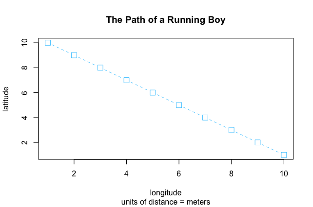

# Basic Line Plot

This plot depicts the path of a running boy. The x-axis is labeled as longitude distance in meters, while the y-axis is labeled as latitude distance in meters. The plotted points are connected by a dashed line, showing a decreasing relationship between longitude and latitude. 
