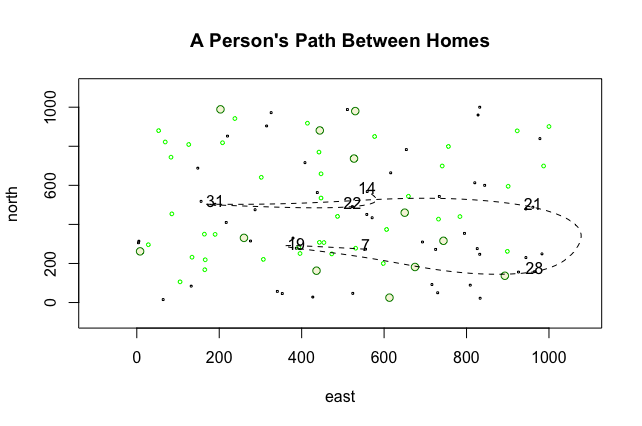

# Creating a More Complicated Plot While Also Creating and Then Using a Data Frame

This plot depicts a person's path between homes. The x-axis represents distance traveled to the east, while the y-axis represents distance traveled north. This plot contains 10 randomly selected and labeled dwellings, along with randomly plotted trees. To emphasize a more sustained path of travel, I used a spline between 3 of the 10 dwellings.

# Challenge Question 

In this plot, I adjusted the code to expand the dimensions to 1000 x 1000. As in the prior plot, the boxes represent 50 dwellings that were randomly generated using the sample() command. Again, there are tress interspersed throught the plot, with 12 big trees and 40 small trees. 7 dwellings were chosen at random to be labeled. The path between these 7 dwellings is marked with a dashed line. 
