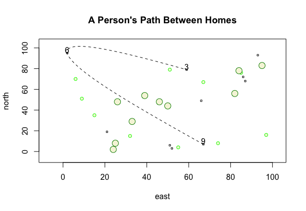

# Creating a More Complicated Plot

This plot depicts a person's path between homes. The x-axis represents distance traveled to the east, while the y-axis represents distance traveled north. This plot contains 10 randomly selected and labeled dwellings, along with randomly plotted trees. To emphasize a more sustained path of travel, I used a spline between 3 of the 10 dwellings.
