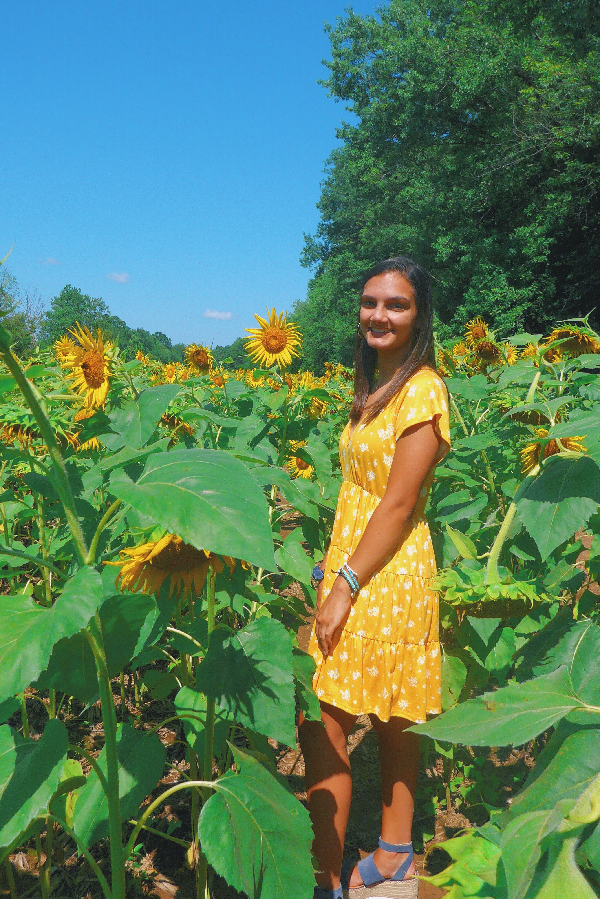

# Data 100 Wicked Problems

Hi, I'm Julia! I'm from the Vienna/Oakton area of Northern Virginia, and I intend to major in Neuroscience and Hispanic Studies on the pre-dental track. In terms of school, I love all math or science related topics, and specifically I enjoy learning about behavior and personality. Outside of school, I like to read any genre of book, to work out, and to take my dog on long walks. 

## Index
[Aug. 22, 2020: Creating And Plotting Objects](Practice1.md)

[Aug. 24, 2020: Creating A More Complicated Plot](Practice2.md)

[Aug. 27, 2020: Data Management Basics](data_mgt.md)

[Sep. 05, 2020: Project 1 Part 1](project1pt1.md)

[Sep. 15, 2020: Project 1 Part 2](project1pt2.md)

[Sep. 21, 2020: Project 2](project2.md)

[Oct. 05, 2020: Project 3](project3.md)

[Oct. 19, 2020: Project 4](project4.md)

[Nov. 02, 2020: Project 5](project5.md)

[Nov. 24, 2020: Final Project](finalproject.md)

## Data Science Reflections
[Sep. 11, 2020: Reflection 1](DSreflection1.md)

[Sep. 25, 2020: Reflection 2](DSreflection2.md)

[Oct. 15, 2020: Reflection 3](DSreflection3.md)

[Oct. 30, 2020: Reflection 4](DSreflection4.md)

[Nov. 13, 2020: Final Reflection](DSfinalreflection.md)
