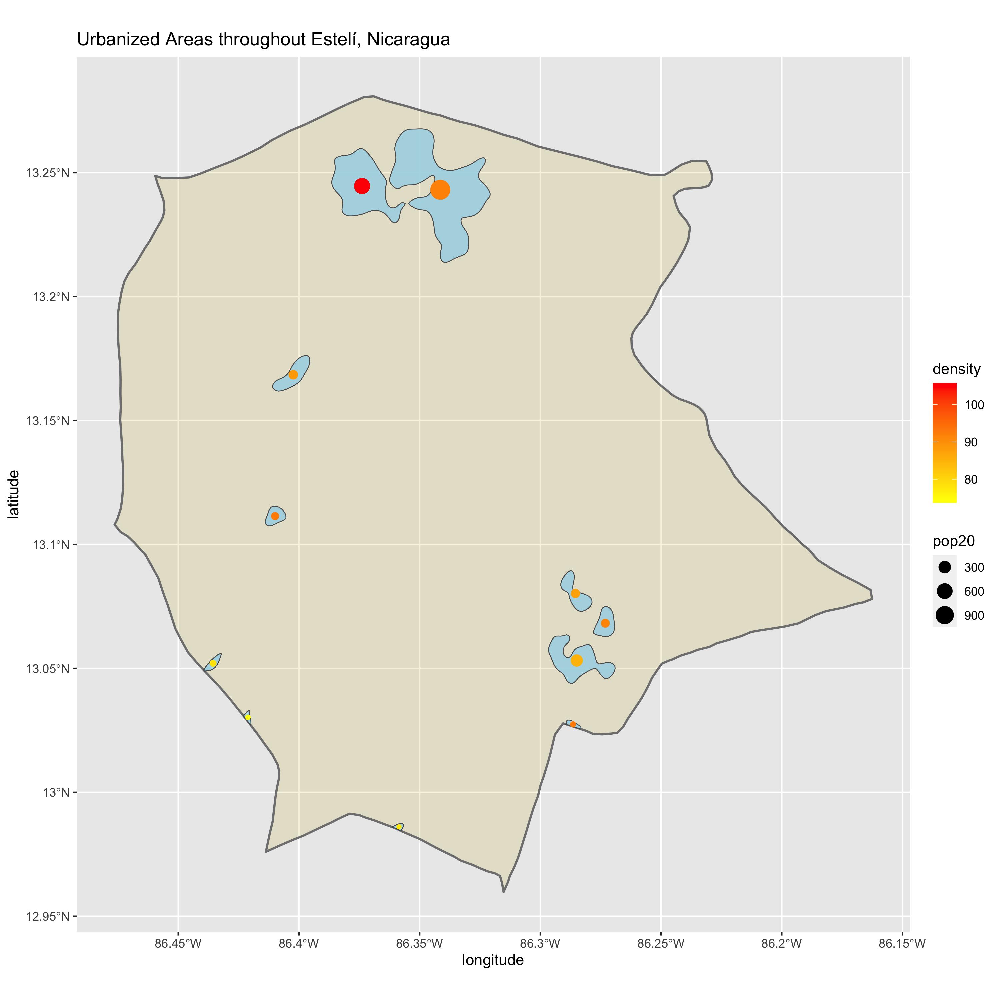
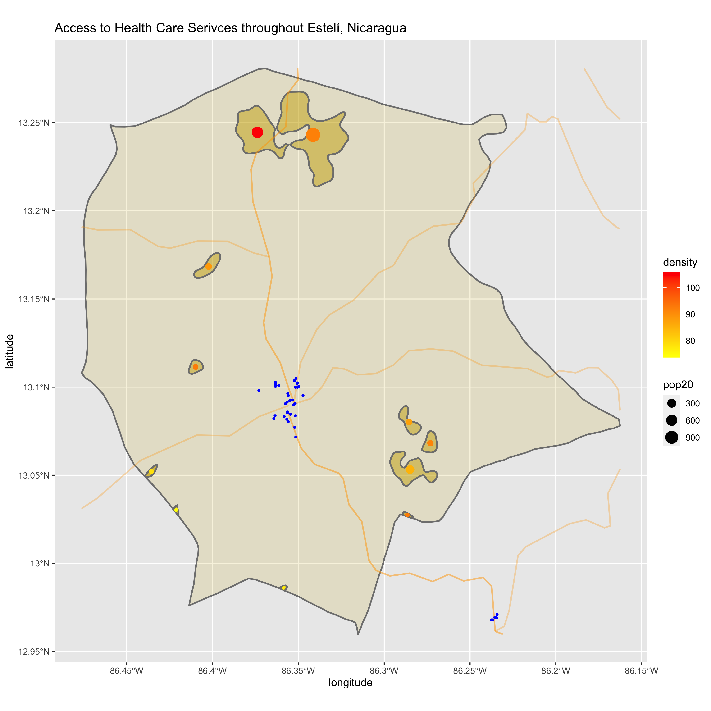
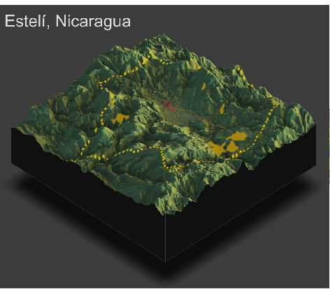

# Accessibility 1
## De facto Description of Estelí, Nicaragua

First, I utilized data from the ADM2 subdivision in Nicaragua: Estelí, which is the third largest city in Nicaragua. 

# Accessibility 2

## Adding transportation facilities & health care services

Next, I added data for the health care facilities and transportation routes in Estelí. Based on the following plot, the main health care facilities are most concentrated at the intersection of the main roads. The roads I used for my plot are the primary and secondary routes. 

# Accessibility 3

## Rendering Topography

Finally, I added the transportation routes, health care facilities, and urban areas to the topography of Estelí, Nicaragua. Based on the plot, topography appears to have impacted the development of health care facilies areas in that they are nestled in the valley surrounded by higher elevation areas. However, the most populated areas appear to not be dependent on topography, as they are distributed across varying areas of elevation. The primary route shown on the plot runs through the area densely packed with health care facilites, which makes sense as these facilities likely need a well-established connection to the rest of Nicaragua. It is important to note that the urban areas seem to not be in close proximity to the health care facilites, which would pose significant problems to the residents of those areas. 

