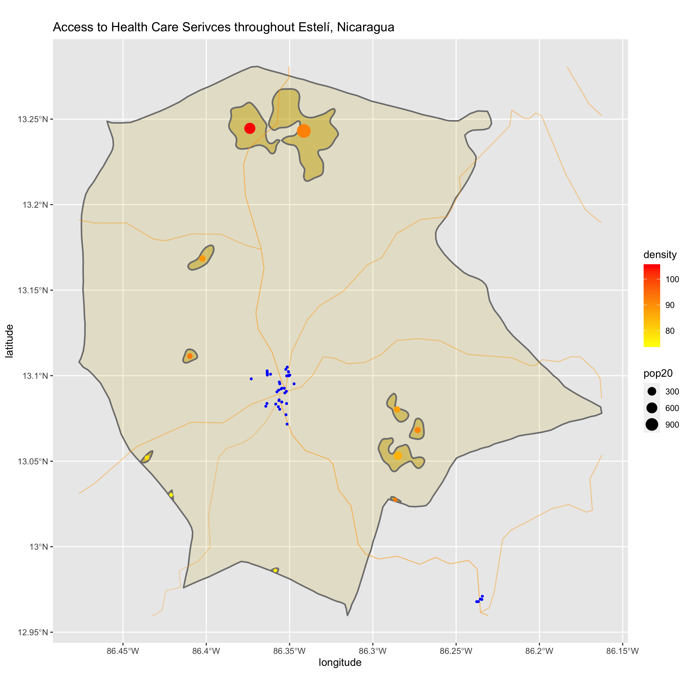

# Accessibility 1
## De facto Description of Estelí, Nicaragua

First, I utilized data from the ADM2 subdivision in Nicaragua: Estelí, which is a moderately populated area. 

# Accessibility 2

## Adding transportation facilities & health care services

Next, I added data for the health care facilities and transportation routes in Estelí. Based on the following plot, the main health care facilities are most concentrated at the intersection of the main roads. The roads I used for my plot are the primary and secondary routes. 

