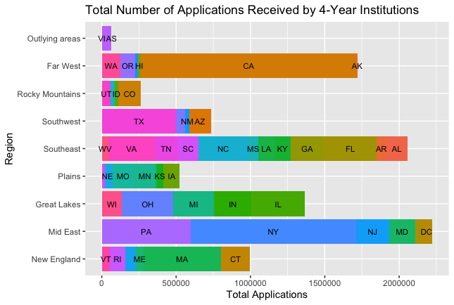

# Project 1 Part 1: Data Management Basics - Merging, Categorizing & the Grammar of Graphics

## Deliverables: Total Applications
The following 2 plots illustrate how many applicants U.S. universities received by region. The best method for displaying this data was by using a horizontal bar plot, with the bars split up by state within each region. The first plot shows the total number of applications received by institutions offering at minimum a 4-year degree, while the second plot shows the total number of applications to institutions that offer at minimum a doctoral degree. 

## Stretch Goal:Total Enrolled

![](
