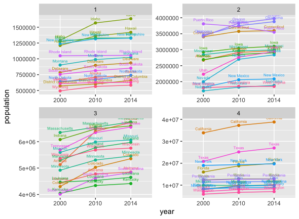

# Project 1 Part 2: Data Management Fundamentals - Application Program Interfaces & Tidying Up Data 

The following plot utilizes data from the Federal Census Bureau that was collected in 2000, 2010, and 2014. The plot shows the population of all 50 states, along with Puerto Rico and D.C., for each year. The population data is split into 4 quantiles based on the range of population. 

## Deliverable 1
 
