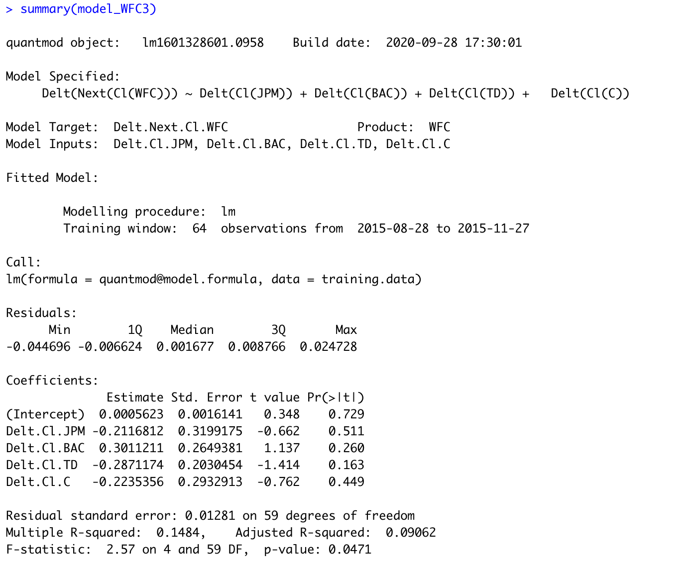

# Part 1

## Independently Accessing an API and Creating your Own Plots

In part 1 of this project, I retrieved data public data from a remote server provided by the Federal Census Buraeu, using an API. The data I used was American Community Surveys 5-year data API, which contains the populations of 52 U.S. subdivisions. The first plot shows the absolute population increase between 2010 and 2014 of all 52 primary US subdivisions and facets this data into 9 quantiles. Similarly, the second plot shows the average annual growth rate between 2010 and 2014 of all 52 U.S. subdivisions, represented with 9 quantiles. 

# Part 2

For part 2 of this project, I obtained stock data using the quantmod package, which allowed me to analyze and predict the data. I choose to examine publicly traded banks, specifically looking at Wells Fargo, JP Morgan, Bank of America, TD Bank, and Citi Bank, creating a statistical model. To predict Wells Fargo's future stock price as the response variable, I used a more specific model with the current stock prices of the other banks as the predictor variables.

