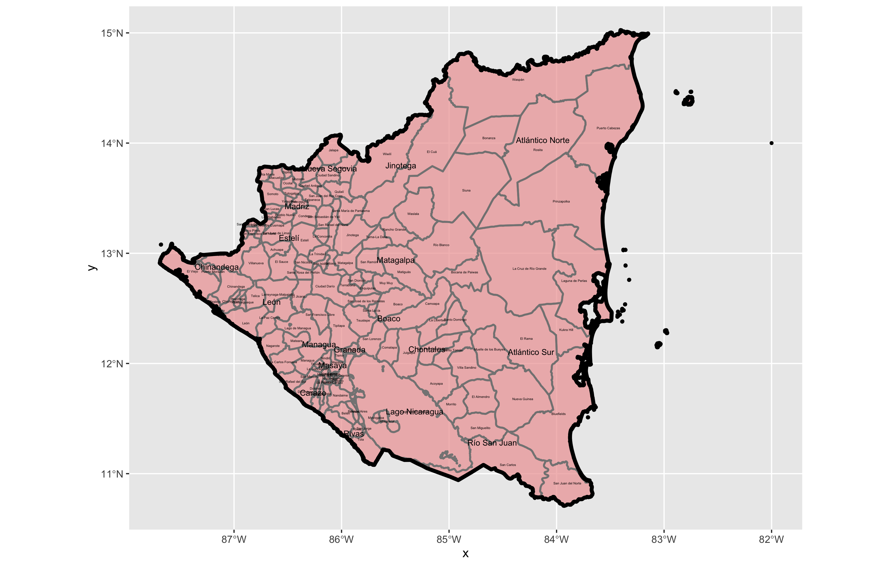
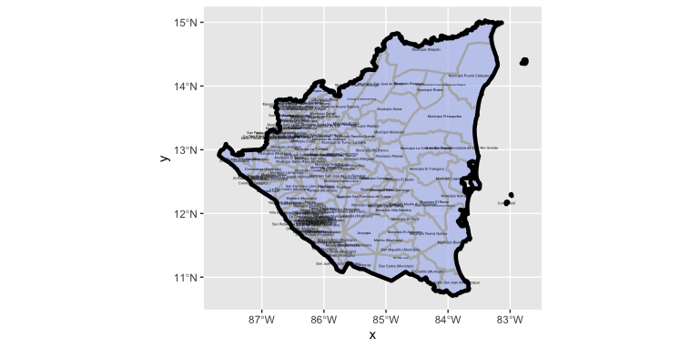

# Part 1 

## Projecting, Plotting and Labelling Administrative Subdivisions

For this project, I utilized spatial data from GADM to describe the administrative boundries of Nicaragua. The plot displayed below outlines the location of Nicaragua geographically in regards to its coordinates, along with the subdivisions within the country. 

### Stretch Goal 1

For the plot below of Nicaragua, I utilized spatial data from a different source: geoBoundries (which happens to be run by William & Mary). As I did for the prior plot, I took the shapefiles for ADM0, ADM1, and ADM2 from this website to produce the plot. The most apparent difference between this plot and the one I made using the spatial data from GADM is that the plot below contains more labels of the subdivisions. This is likely due to the fact that the geoBoundries data is more recent and frequently updated, so it contains more subdivisions. 

