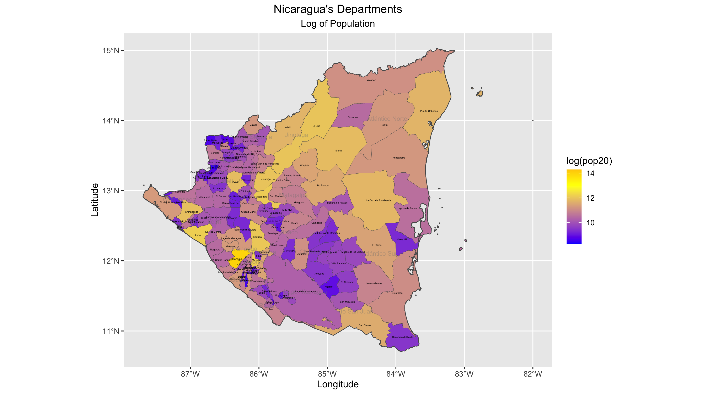

# Part 1
## Extracting Populations from a Raster and Aggregating to each Unit

The following plot shows Nicaragua's adm1 subdivisions from 2020. The differentiation in color shows the variation in population totals. 

### Stretch Goal 1

This extension of the project shows the adm2 subdivisions of Nicaragua, while again highlighting the differing populations throughout the country.

### Stretch Goal 2

For this next plot, I took the log of the population distribution of Nicaragua's departments.

