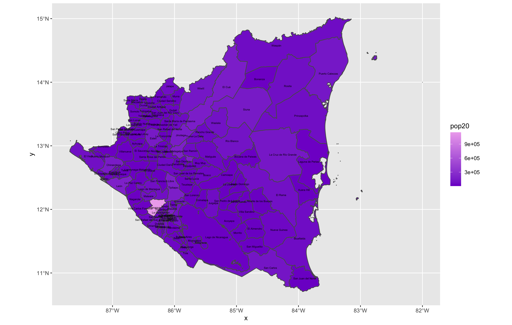

# Part 1
## Extracting Populations from a Raster and Aggregating to each Unit

The following plot shows Nicaragua's adm1 subdivisions from 2020. The differentiation in color shows the variation in population totals. 

### Stretch Goal 1

