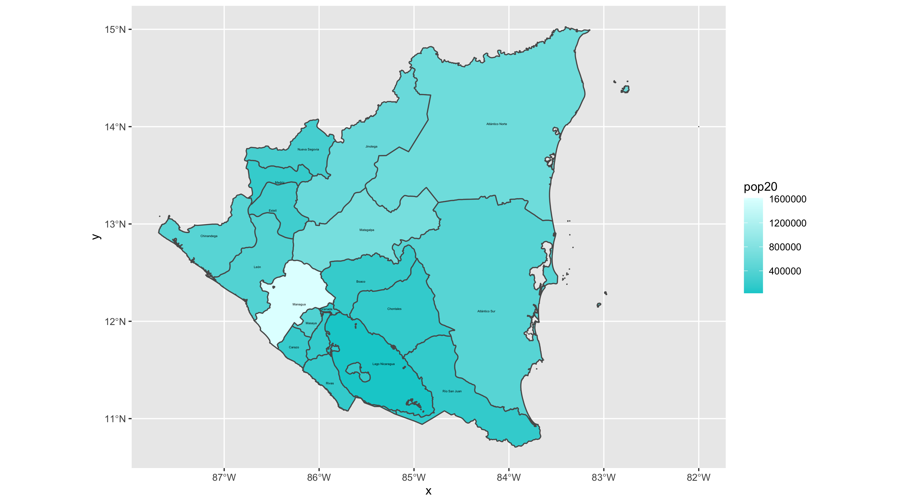

# Part 1
## Extracting Populations from a Raster and Aggregating to each Unit

The following plot shows Nicaragua's ADM1 subdivisions from 2020. The differentiation in color shows the variation in population totals. 

### Stretch Goal 1

This extension of the project shows the ADM2 subdivisions of Nicaragua, while again highlighting the differing populations throughout the country.

### Stretch Goal 2

For this next plot, I took the log of the population distribution of Nicaragua's departments.

# Part 2
## Creating a Geometric Bar Plot with a Simple Feature object

The following shows the combined spatial description and geometric bar plot for the density of the ADM1 subdivisions of Nicaragua. This better displays the population distribution.

### Stretch Goal 1

For this plot, I used the ADM2 sf object I created in part 1 of this project to create a geometric barplot to describe population.

