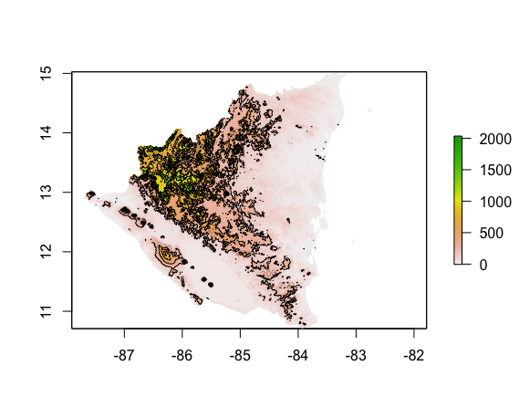
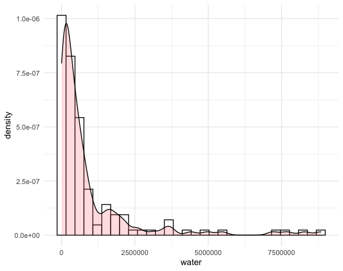

# Acquiring, Modifying, and Describing Data & Extracting Land Use and Land Cover Data for Description

### Plot of RasterStack

This plot is a histogram that shows the distribution of the log of the population density in Nicaragua.

Again, the following density plot is a histogram, but instead shows the distribution of proximity to water in Nicaragua.

