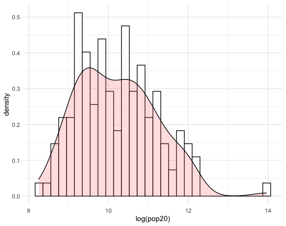

# Part 1
## Acquiring, Modifying, and Describing Data & Extracting Land Use and Land Cover Data for Description

This plot is a histogram that shows the distribution of the log of the population density in Nicaragua.

